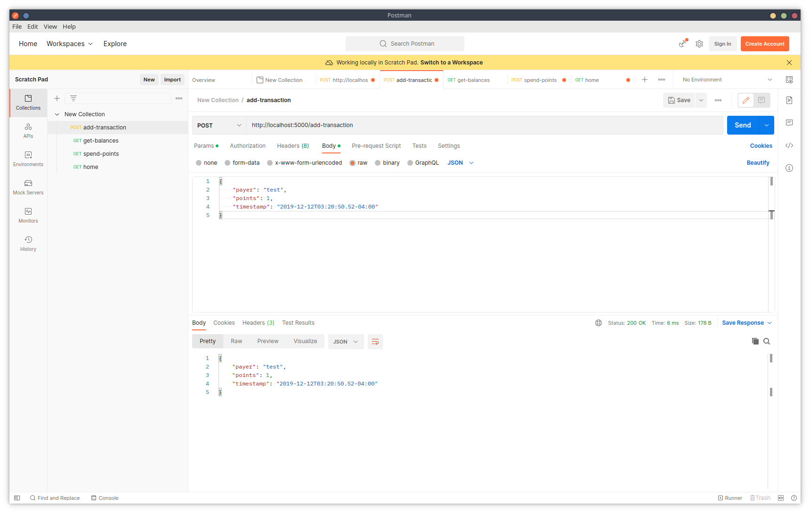
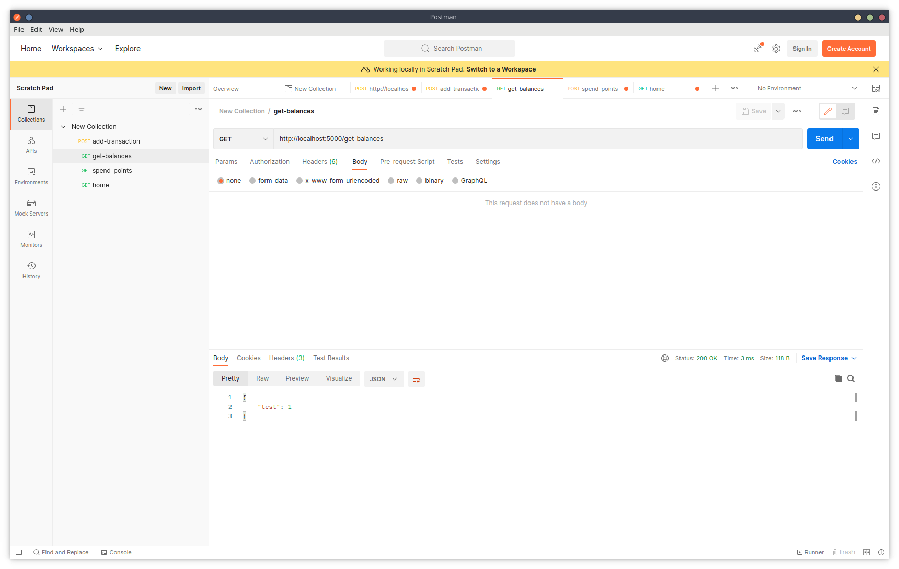
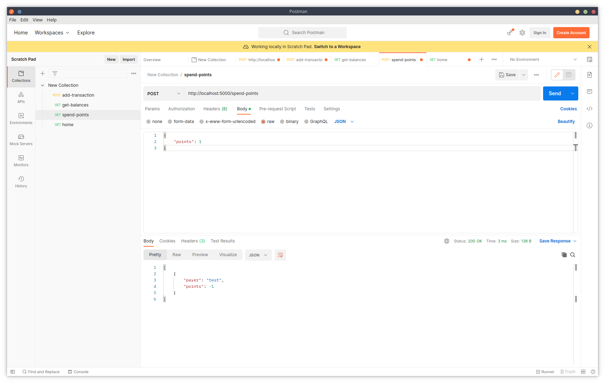

# fetch-rewards-take-home-test

This git repository contains the Fetch Rewards Take Home Test.

Before running this application, the latest version of go or go version 1.18.1 or higher must be installed. To install the go language, documentation can be found on their website here: https://go.dev/dl/

To run this application, first clone the repository by using:
- https: https://github.com/jmanusig1/fetch-rewards-take-home-test.git
- ssh: git@github.com:jmanusig1/fetch-rewards-take-home-test.git

If you run the application using "go run main.go" several packages may not be installed. Install these packages: 
- go get github.com/stretchr/testify/assert  
- go get github.com/gofiber/fiber/v2 

After installing these dependencies, you may now run the program using the command "go run main.go" and it will run on the port 5000.

To test the program it is recommended to use Postman as it is the easiest way to verify the program. You can download and install Postman here https://www.postman.com/downloads/

When using Postman, to 
- test adding a transaction for a specific payer and date, 
    - populate the URL with a POST request: http://localhost:5000/add-transaction
    - populate the body with a raw JSON denoting the payer as a string, points as an int, and timestamp as a time unit: 
        {
            "payer": "payer",
            "points": 1,
            "timestamp": "2019-12-12T03:20:50.52-04:00"
        }
    - hit send after populating the above mentioned
    - the user will be returned a json of the transaction inputted. If there is anything wrong, the user will get an error similar to insufficient funds or a bad request.
    - 

- test getting the payer-point balances
    - populate the URL with a GET request: http://localhost:5000/get-balances
    - hit send after populating the URL
    - the user will be returned a JSON object containing all the payer point balances the user has similar to the following... 
        {
            "payer1": 10,
            "payer2": 20
        }
    - 

- test spending points
    - populate the URL with a POST request: http://localhost:5000/spend-points
    - populate the body with a raw JSON denoting the points as an int:
        {
            "points": 1,
        }
    - hit send after populating the above mentioned
    - the user will be returned a JSON object containing all of the payer point balances that were used during the transaction similar to the following...
        {
            "payer1": -1
        }
        or the user will get an error similar to insufficient funds or a bad request. 
    - 

However, there are also unit test suites in the code that you can run using the command "go test". To run these tests, run the command "go test" in each of the directories. 

The program itself does not use a durable data store such as gorm, sql, or any other persistent data storage. Therefore, any new instances of the program that is run will have a clean slate to work with. 
